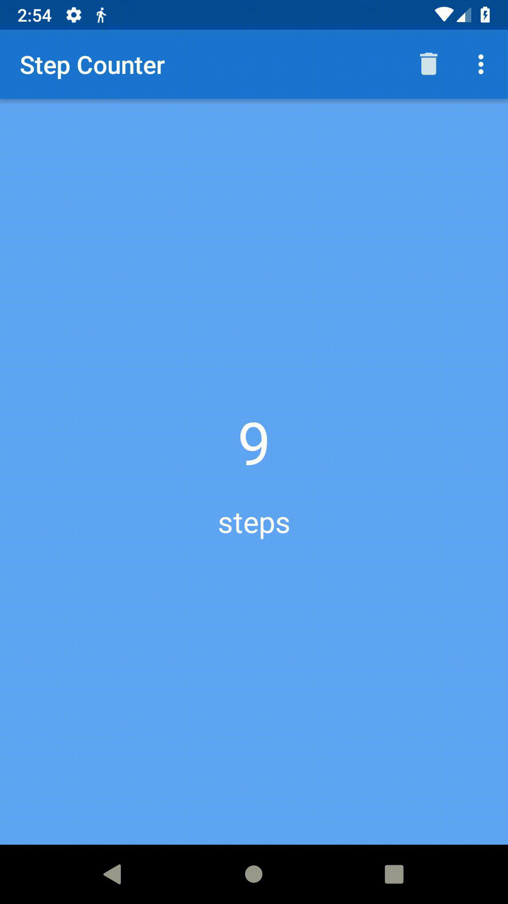

# Step Counter App for Android

## What It Is
The demo project using Android sensors (Accelerometer and StepCounter). Foreground service, MVVM, LiveData and dynamic options menu. Room database and SharedPreferencies observable by LiveData. App theme styles.

## License

This project is licensed under the terms of the MIT license. You may obtain a copy of the License in the LICENSE file, or at:

https://opensource.org/licenses/MIT

